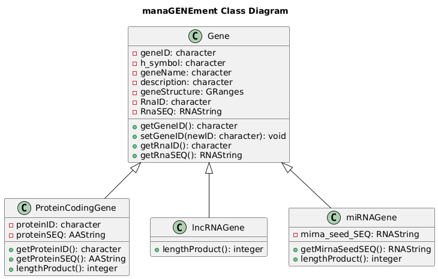

# manaGENEment

**manaGENEment** is an R package designed for the management and analysis of various gene types, including protein-coding genes, long non-coding RNA (lncRNA) genes, and microRNA (miRNA) genes. It provides a framework for creating gene objects, extracting and edit their attributes, and performing length computations essential for genomic studies.

## Features

- **S4 Class Structures**: Defines classes for different gene types with specific slots
- **Accession and Edit Methods**: Provides methods to retrieve and modify gene attributes
- **Length Computation**: Implements methods to compute the length of RNA and protein sequences
- **Integration with Bioconductor**: Utilizes `GenomicRanges`, `Biostrings`, and `IRanges` for genomic data management for better compatibility with most genetic pipelines


## Installation

You can install the development version of manaGENEment from GitHub through `devtools` package:

```r
# Install devtools if not already installed
install.packages("devtools")

# Install manaGENEment from GitHub
devtools::install_github("AlexDellOrti/manaGENEment")
```

## Classes

manaGENEment defines several S4 classes to represent different gene types. Here is an overview of these classes, their attributes and methods:

<div align="center">
  
</div>


#### Gene
Attributes:
 - **geneID**: Character string representing the unique identifier of the gene.
 - **h_symbol**: Character string for the gene’s symbol.
 - **geneName**: Character string for the gene’s name.
 - **description**: Character string describing the gene.
 - **geneStructure**: GRanges object detailing the gene’s genomic structure.
 - **RnaID**: Character string for the RNA identifier.
 - **RnaSEQ**: RNAString object containing the RNA sequence.
Methods:
 - **getGeneID()**: Retrieves the geneID of the gene.
 - **setGeneID(newID: character)**: Sets a new geneID for the gene.
 - **getRnaID()**: Retrieves the RnaID of the gene.
 - **getRnaSEQ()**: Retrieves the RnaSEQ of the gene.

#### ProteinCodingGene
Attributes:
 - (Inherits all attributes from Gene)
 - **proteinID**: Character string for the protein identifier.
 - **proteinSEQ**: AAString object containing the protein sequence.
Methods:
 - **getProteinID()**: Retrieves the proteinID.
 - **getProteinSEQ()**: Retrieves the proteinSEQ.
 - **lengthProduct()**: Computes the length of the protein sequence.

#### lncRNAGene
Attributes:
 - (Inherits all attributes from Gene)
Methods:
 - **lengthProduct()**: Computes the length of the RNA sequence.

#### miRNAGene
Attributes:
 - (Inherits all attributes from Gene)
 - **mirna_seed_SEQ**: RNAString object containing the miRNA seed sequence.
Methods:
 - **getMirnaSeedSEQ()**: Retrieves the mirna_seed_SEQ.
 - **lengthProduct()**: Computes the length of the RNA sequence.


## Documentation
To understand how functions, classes, and methods work, check out the docs!
```r
# Access documentation for ProteinCodingGene constructor
?ProteinCodingGene

# View all available functions and methods
library(help = "manaGENEment")
```


## Vignettes
To check out vignettes, use:
```r
browseVignettes("manaGENEment")
```


## Contact

**Alexander Dell’Orti**

Email: alexander.dellorti@mail.polimi.it

GitHub: AlexDellOrti


